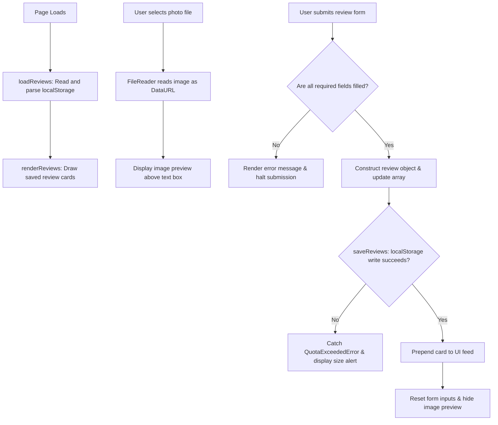

# [Reviewing your Travels]

<!-- Badges are optional but cheap. shields.io generates them from a URL. -->


> HW3, MGT 3745 O. Replace every [bracketed prompt] with your own writing.
> Lines between `<!--` and `-->` are notes to you. They are invisible on GitHub. Delete them when done.
> This README is the first thing an employer, a teammate, or an agent reads. It makes
> a case for the repository. Show, then tell.

## Reviews

The **Photo Review & Travel Logging App** provides casual travelers with a low-pressure environment to document spot reviews with images, custom ratings, and descriptive text without relying on external cloud dependencies. This repository implements the core **Category Photo Review & Ranking** feature specified in [FEATURES.md](context/FEATURES.md) to address the user personas detailed in [PROJECT.md](context/PROJECT.md).

## See It Work

<!-- REQUIRED: at least one image or GIF of the feature meeting an EARS statement.
     Put media in the docs/ folder. Keep GIFs under 5 MB.
     Record: macOS Cmd+Shift+5, Windows Win+Alt+R or Snipping Tool video. Convert at ezgif.com.
     Markdown image syntax: -->
The gif shows a demonstration of a user reviewing a location they visited while including the name of the place and an image and then saving that entry. It then goes into the feed below of previous entries too.


<!-- HTML gives you sizing control markdown does not: -->
<!--  -->

## How to Run
This project runs inside a GitHub Codespace. No local install.

1. On your repository page, click **Code → Codespaces → Create codespace on main**. Wait for setup to finish; first-boot time varies.
2. Keep the supplied `.devcontainer/devcontainer.json`. It configures Live Server installation and port 5500 forwarding. Once the extension is ready, right-click `index.html` and choose **Open with Live Server**, or use **Go Live**.
3. If a browser tab does not open, use the **Ports** tab to open port 5500. Keep its visibility **Private**.
4. With Live Server running, save your edits to reload the page.

If Live Server is unavailable, run `node scripts/serve.mjs` in the terminal, then open port 5500 from the Ports tab. Refresh the browser after edits when using this fallback; stop it with **Ctrl+C**. Run only one server on port 5500 at a time. The fallback also works locally with Node 22 or later. Serve over HTTP rather than opening `index.html` through `file://`.

<!-- The .devcontainer folder installs Live Server automatically. If the right-click option
     is missing, wait for the extension to finish installing (bottom-left status bar), or run
     `python3 -m http.server 5500` in the terminal and open port 5500 from the Ports tab.
     Edit these steps if your feature needs anything more. -->

## How It Works

<!-- GitHub renders Mermaid natively inside a ```mermaid fence. -->



When the page opens, loadReviews reads the stored array from localStorage and renderReviews draws the cards safely using textContent for user string inputs. When an image file is selected, FileReader converts the file to a Base64 Data URL to generate a live preview. Upon form submission, input validation checks for empty fields before pushing the new review into the local state array and writing to localStorage.

## Status

| Area | State | Evidence |
|------|-------|----------|
| Save and render photo review | Works | Visual Proof: [`docs/demo.gif`](docs/demo.gif) \| Code: [`app.js#L21`](app.js#L21) |
| Live image preview | Works | Visual Proof: [`docs/demo.gif`](docs/demo.gif) \| Code: [`app.js#L66`](app.js#L66) |
| Data persistence across reload | Works | Visual Proof: [`docs/demo.gif`](docs/demo.gif) \| Code: [`app.js#L13`](app.js#L13) |
| Empty input validation | Works | Verified via [`app.js#L86`](app.js#L86) |
| Large file quota limit handling | Failed | Verified via [`app.js#L113`](app.js#L113) |
| Multi-device cloud sync | Deferred | Postponed to backend phase per [`ADR-001.md`](context/ADR-001.md) |


<details>
<summary>Verification results (click to expand)</summary>

Keep the full verification record in [FEATURES.md](context/FEATURES.md).

Cover a normal action, relevant invalid input, and persistence or failure. PASS requires observed results that match expectations; all-PASS is acceptable with evidence. For CANNOT TEST, state the limitation and next step. Identify unselected requirements separately; DEFERRED does not waive the required HW3 feature. A screenshot alone cannot establish reload or storage-failure behavior.

</details>

## Links

Read in this order:

0. [`SCAFFOLD_MANIFEST.md`](SCAFFOLD_MANIFEST.md): explains what carries over from HW2 into HW3, along with a submission checklist
1. [`context/PROJECT.md`](context/PROJECT.md): the problem and its framing
2. [`context/USERS.md`](context/USERS.md): who this is for
3. [`context/FEATURES.md`](context/FEATURES.md): what it must do, and verification results
4. [`context/ARCHITECTURE.md`](context/ARCHITECTURE.md): the gate and ADR-001
5. [`context/STANDARDS.md`](context/STANDARDS.md): the rules this code follows
6. [`context/CLAUDE.md`](context/CLAUDE.md): the same rules, for agents

The scaffold has **eleven canonical files in `/context`: six active files above and five previews**: [STYLE.md](context/STYLE.md), [TOOLS.md](context/TOOLS.md), [SKILLS.md](context/SKILLS.md), [EVALS.md](context/EVALS.md), and [AGENTS.md](context/AGENTS.md). Keep the previews; verification stays in FEATURES.md until EVALS.md activates in Module 5.

Root README.md and the two instruction adapters—[CLAUDE.md](CLAUDE.md) and [.github/copilot-instructions.md](.github/copilot-instructions.md)—are additional files. Copy your HW2 USERS.md and FEATURES.md into `/context` and revise them using instructor feedback if available; otherwise record a peer criterion check and mark instructor feedback pending. Run `node scripts/check-scaffold.mjs` to check required file presence; this does not assess content quality.

<!-- A Delegation Decision Record without the name. From HW5 this becomes a formal DDR. -->
## AI Use

**Tool and task delegated:** I used AI assistance to draft and refine the core photo review feature, including image file uploading, generating live image previews, persisting cards in `localStorage`, validating empty fields, and resetting the form state. Once I understood how `app.js` interacted with `index.html`, it was much easier to go in and tweak the UI layout and error messages.

**Why:** I delegated the initial build because writing the full file-handling and storage logic from scratch would have taken me days of learning. Having an agent draft the initial code gave me a solid baseline to review, test, and customize so it fit the specifications in `FEATURES.md`.

**How it was checked:** I tested every feature on the live page against `FEATURES.md` and `STANDARDS.md`. When things broke, I fixed them—like swapping `innerHTML` for safer `textContent` to prevent security issues, making sure variables used camelCase, and confirming the image preview cleared on form resets.

**Observed result / evidence:** Testing initially failed on empty form submissions (creating empty review cards) and large file uploads. After adding validation checks, empty input handling passed (**EARS-4**). The complete testing record is in the Verification section of `FEATURES.md`, and visual proof is linked in the Status section.

**Instruction discovery and compliance:** GitHub Copilot discovered the applicable context rules in `CLAUDE.md` and `STANDARDS.md`. It stated: *"I’ll inspect the context documents first, then update the interface structure using strict separation of concerns."* I manually reviewed the code to enforce zero inline styles and verify secure DOM rendering. 

**Actual hours on this assignment:** If I were to guess, it was probably around 10 hours total across 4 days.

## Explain, Change, Verify

### Code Snippet (`app.js`)

```javascript
reviewForm.addEventListener('submit', (event) => {
  event.preventDefault();

  const spotName = spotNameInput.value.trim();
  const reviewText = reviewTextInput.value.trim();

  if (!spotName || !currentBase64Image || !reviewText) {
    showStatus('Please provide a spot name, select an image, and write a review.', false);
    return;
  }

  const newReview = {
    id: Date.now(),
    spotName: spotName,
    imageData: currentBase64Image,
    reviewText: reviewText,
    createdAt: new Date().toISOString()
  };

  try {
    const reviews = loadReviews();
    reviews.unshift(newReview);
    saveReviewsToStorage(reviews);

    spotNameInput.value = '';
    spotImageInput.value = '';
    reviewTextInput.value = '';
    currentBase64Image = '';
    imagePreviewContainer.classList.add('hidden');

    showStatus('Photo review saved successfully!', true);
    renderReviews();
  } catch (error) {
    showStatus('Failed to save review. The photo file may be too large.', false);
  }
});

renderReviews();
```


**Input:** The form submission `event` triggered by clicking `#submit-btn`, along with string values extracted from `#spot-name`, `#review-text`, and the image.

**State Changes:** If any inputs are missing, it shows an error message and stops. If valid, it saves the new review to localStorage, resets the form, and updates the display list.

**Output:** Halts execution when inputs are missing or invalid; returns `undefined` after updating storage and UI state.

```
reviewForm.addEventListener('submit', (event) => {
  event.preventDefault();

  const spotName = spotNameInput.value;
  const reviewText = reviewTextInput.value;

  const newReview = {
    id: Date.now(),
    spotName: spotName,
    imageData: currentBase64Image,
    reviewText: reviewText,
    createdAt: new Date().toISOString()
  };

  const reviews = loadReviews();
  reviews.unshift(newReview);
  saveReviewsToStorage(reviews);

  spotNameInput.value = '';
  spotImageInput.value = '';
  reviewTextInput.value = '';
  currentBase64Image = '';
  imagePreviewContainer.classList.add('hidden');

  renderReviews();
});
```

**Before / After Change:** Originally, form submission attempted to save review objects without checking if required text fields or images were empty, resulting in blank review cards in `localStorage`. I added the explicit `if (!spotName || !currentBase64Image || !reviewText)` guard clause alongside a `try...catch` block surrounding `saveReviewsToStorage()`.

**Expected Effect:** Prevent empty review submissions, stop unhandled exceptions when `localStorage` quota limits are hit, and display helpful feedback to the user without breaking state.

**Observed Result & Evidence:** Clicking "Save Review" with empty fields immediately displayed red error text, halted submission, and left `localStorage` untouched without rendering a blank card.

**Why It Matters:** This change directly satisfies requirement **EARS-4** (invalid input handling) and keeps local storage clean from incomplete or corrupted review data.
